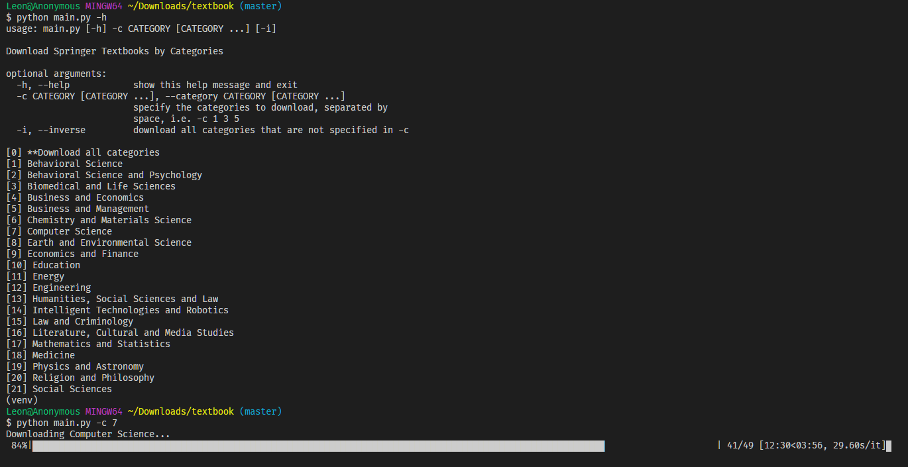

# Springer Free Textbooks Downloader

## Overview

Springer Nature is giving free access to more than 500 textbooks from all disciplines as an initiative to support learning and teaching for tertiary institutions during the COVID-19 outbreak. This program downloads the textbooks in both pdf and epub (if provided) format by the specified categories such as Computer Science or Medicine.

## Requirements

- Python 3

## Installation and Usage

    pip install -r requirements.txt
    python main.py --help

## Link

https://www.springernature.com/gp/librarians/news-events/all-news-articles/industry-news-initiatives/free-access-to-textbooks-for-institutions-affected-by-coronaviru/17855960